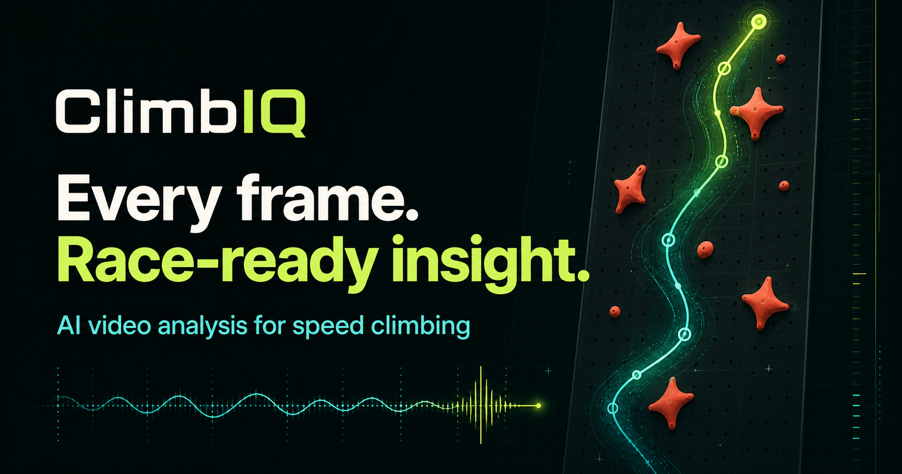

# ClimbIQ Detection Lab

[](https://github.com/ericqin0816/ClimbIQ/actions/workflows/ci.yml)

**Local-first video analysis for speed climbing.** ClimbIQ turns an ordinary race video into reviewable timing markers, route splits, and wall-projected biomechanics without uploading the video.

[Try the live detection lab](https://climbiq-detection-lab.vercel.app)

[College demo guide and measured talking points](COLLEGE_DEMO.md)



## What It Does

- Detects the official start protocol from synchronized audio and timing-light evidence.
- Finds first movement and finish timing while keeping every suggested timestamp reviewable frame by frame.
- Tracks the selected athlete through a standardized 15 m speed wall with MediaPipe Pose Landmarker.
- Estimates a 2D wall-projected center-of-mass path, speed, efficiency, route sections, and Hold 10 contact.
- Compares two saved attempts across total time, reaction, reviewed Hold 10 phases, and trustworthy wall thirds.
- Moves a complete saved-attempt library between browsers or computers with a merge-safe JSON backup.
- Processes videos entirely in the browser; videos are never uploaded or stored by ClimbIQ.
- Exports portable JSON datasets and Obsidian-ready training notes.

## Why This Project Exists

ClimbIQ Detection Lab is a working proof of the core video-detection and biomechanics engine for a larger ClimbIQ product. Its purpose is to show that a local speed-climbing video can be sampled frame by frame and converted into useful, inspectable performance data.

This repository focuses on the analysis engine and local attempt comparison. Athlete profiles, native mobile apps, backend services, cloud storage, and an AI coach are intentionally outside the current scope.

## Compare Saved Attempts

Save at least two timed sessions, then open **Attempt comparison**. Choose the older run as the baseline and the newer run as the candidate. ClimbIQ compares only measurements available in both sessions: total time, first movement, reviewed Start → Hold 10 and Hold 10 → Finish phases, and medium/high-confidence COM wall thirds. A negative time means the newer attempt was faster.

Low-confidence values remain visible for review but never receive a gained/lost claim. The headline reports the overall result first, then the largest qualifying contact-phase change (or other available detailed split). Contact phases and COM wall thirds overlap and must not be added together. Attempts default to race-date order; choosing the other selected attempt swaps the comparison direction.

Small differences are displayed as **Below threshold**, not proof of improvement or equality. Until per-marker timing error and source frame intervals are measured and stored, comparison uses conservative display rules: at least 0.100 s for accepted timing, 0.200 s when body-motion estimates define a boundary, and two pose sample intervals for COM sections (0.400 s at 5 fps). These thresholds are policy choices, not validated accuracy bounds or confidence intervals. Both endpoints' confidence limits the section confidence.

Saved COM timing and athlete identity must pass the same freshness check as the main analysis and have valid wall calibration. Corrected or mismatched results withhold both wall splits and the old tracking-quality badge until reanalysis. Session imports and reloads sanitize stored biomechanics before comparison. The panel works without reopening either video.

## Built With

- React 19, TypeScript, and Vite
- MediaPipe Pose Landmarker running on-device with WebAssembly
- `HTMLVideoElement`, Canvas, and Web Audio APIs for local media analysis
- Vitest for deterministic detection and biomechanics tests
- Vercel for the public web deployment

## Why Web First

This lab uses a real `HTMLVideoElement` plus the Canvas API. That keeps frame extraction direct and testable:

- load a local video file with an object URL
- seek to raw video times
- draw video frames to canvas
- read pixel data
- run simple detection logic locally
- copy a debug report when detection fails

Starting with Expo or React Native would add video and canvas constraints before the core detection engine is proven.

## Timing Does Not Depend on Pose

Speed climbing phone videos are difficult for pose detection. The climber can be small, fast, partially occluded, or filmed from an angle that hides the wrist or hand. This lab uses more reliable signals first:

- start signal from an automatically located green-to-blue light transition
- first movement from pixel motion inside the climber's starting body zone
- finish from the selected lane light returning to its learned pre-start state, with official total time as an optional fallback

ClimbIQ now includes optional pose analysis, but pose never changes accepted timing markers. This separation prevents a missed or occluded landmark from silently moving the authoritative Start Signal, First Movement, or Finish Pad timestamps.

## Experimental Biomechanics

Quick Analyze runs MediaPipe Pose Landmarker locally after it has an accepted finish or official total. An unaccepted review cursor cannot silently become the end of a measured climb; review and accept Finish first. It never falls back to the full video when finish evidence is missing. It estimates the selected 3 m lane from separated upper timing-marker groups and the wall-to-mat edge, follows the athlete through the climb range, and builds the center-of-mass path and speed charts. Automatic wall scale is explicitly approximate.

Before automatic wall calibration, ClimbIQ compares robust fixed-scene edges near the start and finish. Frame-wide translation that is materially better explained by a shifted image is treated as camera movement; timing remains available, but COM, metre-per-second output, route registration, and Hold 10 splits pause rather than using one invalid homography for a panned or tilted recording. Local athlete motion and exposure changes are trimmed out of this check.

For more precise metre and m/s output, the **Center of Mass** panel still supports a manual four-corner calibration:

1. Capture a frame showing the complete standardized speed lane.
2. Mark bottom-left, bottom-right, top-right, and top-left lane corners.
3. Confirm that the camera is fixed with no pan, tilt, shake, or zoom.
4. Analyze the accepted Start-to-Finish range at 5, 10, or 15 fps, or let Quick Analyze run it automatically.
5. Review the synchronized skeleton, wall-projected center-of-mass path, speed chart, quality rating, and frame table.

Both automatic and manual lane geometry solve a perspective transform from intrinsic video coordinates to the standardized 3 m × 15 m wall plane. Manual corners provide the higher-accuracy metric scale. Pose joints are projected into wall coordinates before segment centers and whole-body center of mass are calculated.

The COM calculation uses the 12-segment mass and segment-center ratios published by Pandurevic et al. for an adult-male reference population. The result is labeled as an estimated 2D wall projection. It is not a 3D, force, or clinical measurement and may not match every athlete's body proportions.

Velocity is fit from nearby timestamped COM samples rather than assuming perfectly uniform video frames. Gaps longer than 0.25 seconds are not bridged. Extrapolated points and implausible projected jumps are rejected before smoothing, split the trajectory, and cannot inflate path, gain, efficiency, coverage, or speed metrics. Low visible-body coverage, sparse sampling, and multi-person ambiguity produce warnings instead of being silently accepted.

Pose inference begins with a real canvas crop of the selected lane so the distant climber remains large enough for the model; detected joints are mapped back into full-video coordinates for the overlay and wall projection. Tiny upper-wall crops are upscaled to a detector-friendly raster, lead upward as the climber progresses, and retry above the previous anchor instead of centering the larger athlete below. If detection is missed, ClimbIQ expands once, then scans the wall instead of retrying the same empty crop forever. Short tracking losses first search around the last known athlete position before a wider recovery scan.

Top-wall tracking scales the crop with the lane's perspective, and repeated misses stay near and above the last reliable athlete position instead of resetting to the floor. Pose anchors are permanently constrained to the calibrated selected-lane trapezoid, with a horizontal continuity gate that prevents a neighboring climber from taking over after a tracking gap. Lower-confidence distant joints can contribute to an approximate result when the torso and at least 75% of modeled body mass remain usable. Implausible tracking-jump speed spikes are excluded from charts and metrics, and visible trail gaps are not connected with misleading lines.

COM has a second climb-completion guard for late or previously saved finish ranges. A result is clipped at the first credible top completion only when the athlete reached the upper wall or Hold 20 and then shows a continuous, substantial, downward-dominant descent without returning to the top. Normal upward backsteps, brief drops, tracking gaps, and rebounds do not trigger it. Frames after the cutoff are removed from the wall path, speed chart, video overlay, frame table, splits, and recomputed metrics. Correcting a finish earlier can reuse and safely shorten an existing longer analysis; moving it later still requires new frames.

## Automatic Route Splits

Center-of-mass results also calculate wall-height halves and lower/middle/top wall thirds. Split crossings use upward-only COM progress and are never interpolated across tracking gaps longer than 0.25 seconds. ClimbIQ identifies the slowest complete wall section and provides a direct video-review jump. Low-confidence wall sections remain in diagnostics instead of being published as exact main-result splits.

The contact-defined race phases are calculated separately: **Start → Hold 10** and **Hold 10 → Finish** appear only after an accepted Hold 10 contact lies strictly between the accepted Start and Finish. The result also reports the percentage of the race spent before and after Hold 10 and the slower phase's time difference. This prevents the 7.5 m COM crossing from being mislabeled as Hold 10. Exports include both phase times explicitly.

## Automatic Second-Pass Hold 10 Inspection

After the broad pose scan, ClimbIQ revisits a likely Hold 10 event in a window no longer than 2.2 seconds at 15 samples/s. The selected athlete's nearby image-space COM point seeds the scan, avoiding a fresh search from the bottom of the wall. This point is retained in compact sessions, so storage alone cannot change the seed. It positions the crop; it does not establish hand contact. Gradual hand-height crossings are detected across a continuous approach window instead of requiring a large jump in one frame.

**Hold 10 close-up** shows before/candidate/after views with a nearby tracked-hand ring and an identified-hold ring when a valid manual or visually registered target exists. The panel reports the broad cursor, refined cursor, shift, and adjacent tracked sample times. A height passage stays a height estimate; only an identified hold can support a contact candidate. Both require full-video review before setting Hold 10. Disagreement beyond 0.45 seconds or insufficient tracking keeps the original cursor and explains that refinement was inconclusive.

Click a preview to open the full video at its cursor. No timestamp is accepted by clicking a preview. Changing the timing, athlete, wall calibration, target, or underlying analysis invalidates the evidence and any open second-pass review. Cancelling a closer scan restores the video position and keeps accepted timing.

The three previews are temporary local images, excluded from exports and saved sessions. Dataset JSON includes `hold10SecondPassEvidence` while current; a reviewed marker preserves the provenance in its note. After a page reload, upload the matching video, load the saved analysis in **Session details & saved analyses**, and choose **Inspect Hold 10 more closely** to regenerate evidence. The separate full-climb COM trajectory remains unchanged by the short rescan. The full-workflow benchmark checks preview generation, no unreviewed acceptance, cancellation with video-position restoration, and regeneration after loading the saved analysis.

## Visually Registered Holds And Hold 10 Contact

The supplied standardized-route diagram is used as a route-pattern prior, not as a final overlay. ClimbIQ samples several frames strictly between the accepted start and finish, segments persistent red/pink holds, and jointly registers the complete 20-hold pattern with one bounded affine or projective correction. Only directly observed hold centroids receive visible number markers. A stricter expanded search requires at least 12 unique matches and materially lower residual error. It affects hold markers and Hold 10 contact only, never COM calibration or metric speed.

If that fit fails, an athlete-anchored recovery uses the attachment grid from the [published IFSC wall rules](https://images.ifsc-climbing.org/ifsc/image/private/t_q_good/prd/urwl7n2hnnyvhiwiq0xg.pdf). This wider fit requires at least 16 direct silhouette matches, directly observed Holds 9–11, and tighter residual/identity checks. Attachment bolts are fitting references, not hand-contact points; the target still comes from the visible silhouette. On the complete reference clip this changes support from 8 to 19 holds. Registered neighboring hold centers also replace the translated diagram in the hand-disambiguation check. See [the recorded result and limitations](benchmarks/registered-hold10-results.json).

Tiny red bolt dots are rejected by minimum component area and shape gates before route fitting. Only direct macro-hold matches are displayed; fitted or ambiguous markers remain hidden. When an anchored route consensus is trustworthy but Hold 10 itself is not directly visible, ClimbIQ may display that verified subset while pausing automatic Hold 10 contact. A validated manual Hold 10 Zone remains authoritative.

Strongly oblique views are supported by the wall homography when the camera is fixed, but the four actual selected-lane corners must be marked when automatic geometry includes off-wall room or cannot represent visibly sloped top/bottom edges. Automatic calibration now measures wall-surface support and refuses misleading metre/m/s output in that case. Post-finish camera movement is harmless because route sampling and COM analysis stop at the accepted finish.

Hold 10 timing uses a robust hand point from the visible index, pinky, and thumb landmarks, with the wrist as a fallback. Confirmation is based on elapsed dwell time at 5, 10, or 15 fps rather than a fixed frame count. Median filtering absorbs one bad hand landmark, a single short tracking gap can be bridged, and a longer loss starts a new candidate. The detector rejects fast fly-bys, competing Hold 9/11 proximity, missing hand evidence, and every COM-height-only crossing. Contact onset is refined at the tight confirmation boundary instead of being backdated to the broad search-radius entry.

When the route center cannot be registered, a separate review-only fallback can locate a continuous tracked-hand crossing of Hold 10's standardized height. It never accepts contact automatically, never interpolates across a tracking gap, and never substitutes the estimate into race-phase splits. It only opens the exact-frame review workflow so a person can confirm the real hold contact.

Each detected candidate includes deterministic evidence diagnostics and remains reviewable frame-by-frame. Detection never writes an accepted Hold 10 marker by itself: the user must review and set the exact contact frame before either race-phase split appears. Compact saved sessions retain the hand landmarks required to reproduce the same Hold 10 result after reload. A stale pose result cannot populate Hold 10, route splits, or the video overlay after the accepted start, finish, or selected athlete changes. Changing or clearing Start invalidates all dependent markers; an earlier corrected Finish clears markers that now fall outside the climb. Imported session timestamps are range/order checked and unknown evidence labels are downgraded. Manual Hold 10 zones are validated and projected once for both detection and overlay; malformed or off-wall corrections fall back to visual route registration or pause contact timing.

Saved and imported sessions also revalidate video metadata, normalize detection-zone corners, preserve only recognized automatic-zone provenance, reject zero-area or non-finite zones, recompute calibration color distance from valid RGB samples, and discard out-of-video calibration frames. Restored biomechanics frames are restricted to their saved Start→Finish range and have climb-relative times recomputed. Marker chronology is enforced from earliest motion through Hold 10, so invalid edits cannot create negative exported splits. Invalid official totals are ignored rather than steering finish ranking or truncating pose analysis. If browser storage is unavailable or full, ClimbIQ keeps the current analysis on screen and tells the user to export session JSON instead of claiming it was saved.

Suggested timestamps open a dedicated video-review workflow before acceptance. The review panel displays the suggested raw time, frame on screen, adjustment amount, and frame-step controls. Acceptance waits for a paused, decoded frame and reads time from the video element. Marker-input drafts clear after successful edits and reset when changing videos or sessions. Save Session stays visible outside advanced management; custom session names are retained while generated names follow replacement recordings.

The compact review workspace keeps the player and acceptance controls together on desktop and phone screens. Native presented-frame timestamps are used when available, with an explicit approximate-cursor fallback. Closing review cancels pending review seeks; changing videos resets the cursor. Saved markers and dataset exports distinguish `automatic`, `manual-entry`, and `frame-review` acceptance. Older markers without that metadata remain `legacy-unknown` in the export audit. Acceptance records are workflow provenance, never independent ground-truth labels; dataset exports explicitly report `isGroundTruthLabel: false`.

On browsers with `VideoFrame`, the player reads the current source-frame timestamp directly, including while paused or offscreen; compositor callbacks remain a fallback for older browsers. Previous/Next Frame uses that frame's boundary and duration instead of assuming 30 fps. When native frame duration is unavailable, the controls explicitly fall back to approximate 0.03 s cursor steps. Review details and the saved note include source-frame duration when available. This is a presentation interval, not an event-accuracy bound, and it does not change automatic detector timing.

Browser seek behavior still matters: variable-rate test footage can return a decoded frame behind the requested cursor, and reported duration can vary with decode history. The controls navigate browser-decoded frames; they do not promise enumeration of every encoded frame. The panel keeps the actual reported frame timestamp separate from the requested cursor so this limitation is visible.

Pose samples also retain `decodedFrameRawTime` and `sourceFrameDurationSeconds` when available, separately from their sampling cursor. Compact save/load preserves valid metadata; dataset JSON includes a `sourceFrameTimingAudit`. Repeated seeks into the same source image cannot count as separate Hold 10 dwell observations. Legacy samples without native metadata retain their existing interpretation, and malformed imported coordinates/validity flags cannot become valid COM measurements through JavaScript coercion.

Cancelling or failing a rerun before it commits a replacement Start restores the previous analysis context, including its accepted Finish. After a new Start commits, completed stages remain available and unfinished stages may need another run. This prevents preflight lane-calibration changes from silently erasing prior timing on cancellation.

## Start Signal Detection

Before fusion, visual cues are checked for camera cuts and context-poor patches along the bottom edge of landscape footage. Such cues remain inspectable but cannot supply automatic clock votes or shift a valid cue's accepted time. These safeguards do not make edited broadcast footage a validated input format.

Quick Analyze scans the complete clip at several pixel scales and keeps spatially separate left/right lane candidates. Automatic discovery is restricted to the lower 58% of the image because the climber, start holds, and lane sensor are near the bottom. A start must move in the blue direction and reach a verified blue state within the next 0.5 seconds; merely hiding or weakening green cannot backdate a later real start. The blue state may later reverse at the finish without invalidating the start. Higher-resolution refinement samples the strongest green/blue opponent pixels, while trimmed frame-color correction removes exposure drift and large foreground occlusions.

The original local video's audio track is decoded on-device for the known start protocol: a spoken “ready,” two matching preparation beeps near 554 Hz, then an octave-up final beep near 1.1 kHz. ClimbIQ does not transcribe the spoken word. Browser audio is low-pass filtered while it is resampled, preventing high-frequency gym noise from folding into fake beep pitches. It extracts stable pitch sub-runs from noisy speech and can recover the quiet octave harmonic even when a louder voice masks it. High confidence is reserved for the correctly spaced, genuinely matching pair plus octave-up final cue; the earliest valid protocol becomes the authoritative start clock. Generic tones remain review-only.

Before accepting that clock, Quick Analyze performs both a lane-local body audit and a full-frame continuity audit. The selected athlete must produce a new, reliable launch immediately after the proposed cue, the image cannot contain a broadcast cut/reframe, and a valid-race reaction cannot fall below World Climbing's 0.100 s false-start boundary. A cue is sent to frame review when motion was already underway, the first sample is suspiciously strong, no launch is found, the reaction is physically invalid, or the launch is implausibly delayed. Light/audio still provide the precise clock; body motion and scene continuity act as false-acceptance guards.

## First Movement Detection

When the user has not drawn a Start Body Zone, Quick Analyze derives the athlete's lane from the selected light. The automatic body region stops above the light-spill centroid, preventing the electronic color change from becoming fake body motion. Motion uses causal smoothing plus a median/MAD baseline and is only corroborating evidence around the accepted audio/light cue. When two climbers are visible, drawing one rough Start Body Zone tells ClimbIQ which lane controls athlete tracking and the finish.

This does not rely on wrist tracking.

## Automatic Finish Detection

After start acceptance, ClimbIQ reuses that lane-light region. For the supplied timing system, it requires a stable blue climb state, timestamps the first connected faint green-directed change, tolerates one brief blue/dark/occluded frame during the flash sequence, and requires a sustained chromatic green return state for verification. Baseline stability tolerates bounded sensor/exposure noise, but a source-color spike can anchor timing only when the next sample continues toward the verified reversal. Neutral or dark occlusion cannot anchor or confirm a finish, disconnected old flashes are rejected, and the earliest genuinely verified transition wins over later duplicates even when a later duplicate is closer to an optional official-time cross-check. Directional pixel sampling keeps faint green evidence from being hidden by brighter residual blue pixels. The direction is still learned from calibration so reverse-polarity systems remain supported.

When two lanes start together, ClimbIQ retains every lane that supported the accepted start. If the nearly tied first choice never produces a valid finish, the app checks the other start-verified lane sequentially and carries the winning lane into movement and athlete tracking. This prevents tiny browser interpolation differences—or the other climber's light—from making automatic finish detection fail.

If the lower sensor cannot verify a finish, a perspective-aware fallback searches the upper wall without assuming the angled lane stays at one x-coordinate. It combines a discovered electronic indicator with fixed-camera foreground tracking, a robust body top band that ignores thin ropes, continuity and scale checks, physical top reach, and downward reversal. Anchored scoreboards and broad phone occlusions are rejected. Physical-only estimates and upper electronic changes without an official-time cross-check remain review-level. Nearby upper motion cannot independently verify the clock: a foreground spectator can coincide with a timing-unit reset. An entered official total must agree before an upper light can be accepted automatically.

Upper-indicator timing refinement uses the same patch radius as discovery, with explicit pixel-edge coverage. This prevents a tiny light from being diluted into surrounding wall pixels or accidentally enlarged by floating-point rounding. The existing lower-sensor crop policy is preserved: changing its pixel membership produced an unverified new acceptance in testing and was not shipped. This refinement fix is demonstrated by synthetic capture-pipeline tests; it is not a general finish-accuracy estimate.

Official total time remains available as a fallback or cross-check:

```text
Finish Pad raw time = Start Signal raw time + Official total time
Finish Pad climb time = Official total time
```

The app labels light-detected and official-time-derived finishes separately.

A High-confidence finish can be accepted automatically. Unaccepted light or physical-top suggestions remain review cursors, not COM boundaries. If neither an accepted finish nor an official duration supplies a boundary, Quick Analyze pauses before pose analysis.

## Run The Project

```bash
npm install
npm run dev
npm run check
```

Open the dev server URL, choose or drag in one local climbing video, and press **Run full analysis**. Zones are optional unless another person appears in frame or automatic light discovery needs manual help.

### Work from another computer

On a Mac with Codex, clone the same repository once, then open that folder as the Codex project:

```bash
git clone https://github.com/ericqin0816/ClimbIQ.git
cd ClimbIQ
npm install
```

The repository includes `.nvmrc`; if you use `nvm`, run `nvm use` first so the Mac uses the supported Node 22 runtime.

Before starting new work on either computer, sync the pushed `main` branch:

```bash
git pull --ff-only origin main
```

Git synchronizes the app, but browser-saved attempts remain local to that computer. In **Attempt comparison**, choose **Export saved library** on the first computer and **Import session or library** on the second. Import merges by session ID: the newer saved copy wins, local-only attempts remain, and an analysis already open on screen is never silently replaced.

Private videos are intentionally excluded from Git. You can upload a downloaded Drive video directly in the app. To run the repeatable timing benchmark on the Mac, put clips in `node_modules/.climbiq-private-videos/` or set `CLIMBIQ_VIDEO_DIR` to their local folder. The benchmark runner supports the standard macOS Google Chrome location and uses the macOS temporary directory for its isolated profile; set `CLIMBIQ_CHROME` only if Chrome lives somewhere else.

For a full meet replay, open **Review & advanced tools** and enter the absolute source-time window for one race (for example, ignore before `590` and stop the start search at `610`). ClimbIQ analyzes one attempt at a time and limits automatic finish search to 30 seconds after the accepted start so later races and timer resets cannot leak into the result. Edited multi-camera footage is intentionally sent to review when the frame composition changes at the cue.

### Real-video timing regression

Keep private test clips outside Git in `node_modules/.climbiq-private-videos/`, start the development server, then run:

```bash
npm run benchmark:timing
npm run benchmark:summary
```

For a complete analysis → COM → save → duplicate → reload → comparison check on the complete reference recording, run:

```bash
npm run benchmark:timing -- --full IMG_9199.MOV
npm run benchmark:timing -- --full --fps=10 IMG_9199.MOV
npm run benchmark:timing -- --full --fps=15 IMG_9199.MOV
```

Unlike timing-only mode, `--full` does not cancel the pose stage. It checks saved timestamps survive reload and identical saved attempts cannot claim a gain or loss. Known reference clips have explicit coverage requirements; exploratory clips report legitimate tracking/calibration refusals separately. It also tests Hold 10 review, decoded-frame/fallback timestamp provenance, saving, and stale-evidence clearing. It uses an isolated temporary browser profile.

Regression observations are not independent accuracy labels. The old 8903 finish reference is disputed after direct frame inspection. Benchmark summaries now require explicit independent review provenance before reporting accuracy; see [the label audit](REAL_VIDEO_BENCHMARK.md).

The timing runner uses the real browser workflow, stops after timing when possible, compares accepted/review outcomes, raw times, evidence sources, and confidence labels with `benchmarks/real-video-results.json`, and exits nonzero if an expected Start or Finish policy regresses. Set `CLIMBIQ_VIDEO_DIR` for a different private directory, or use `npm run benchmark:timing -- clip1.mov clip2.mov` for a subset or a new exploratory clip. New clips are reported as `unbaselined`; they do not become required regression inputs until they are deliberately added to the benchmark JSON. Private videos and generated frames stay in ignored local directories and are never committed.

`npm run benchmark:summary` also reports the separately labeled public broadcast stress test from `benchmarks/public-broadcast-results.json`, including moving-camera rejection reasons and whether review-only candidates have actually received manual ground-truth labels.

## Deploy On Vercel

This project is configured as a public Vite site on Vercel.

```bash
npm run build
npx vercel
npx vercel --prod
```

Vercel should use:

- Framework preset: Vite
- Build command: `npm run build`
- Output directory: `dist`

The app is still client-only. Uploaded videos are read locally in the browser with `HTMLVideoElement` and canvas; this version does not upload videos, store files, or use a backend.

## Diagnostic Data

Dataset exports retain diagnostic data for troubleshooting without putting developer-only cards in the main workflow. The data includes:

- video metadata
- normalized zones
- frame sampling diagnostics
- start signal detection debug data
- first movement detection debug data
- accepted timestamps
- Hold 10 phase times, bottom/top shares, slower phase, and phase difference

## Obsidian Export

The **Save & export** card can generate an Obsidian-ready Markdown note for each analyzed attempt. Use **Download report**, or open **Copy and Obsidian options**, after accepting timestamps.

The Markdown includes:

- YAML frontmatter for Obsidian properties
- attempt summary
- accepted timestamps
- split calculations
- detection notes and warnings
- athlete notes and review questions
- a fenced JSON block with machine-readable data

Suggested vault structure:

```text
ClimbIQ Training Log/
Attempts/
Exports/
Debug Reports/
Templates/
```

Suggested workflow:

1. Create an Obsidian vault called `ClimbIQ Training Log`.
2. Create folders: `Attempts`, `Exports`, `Debug Reports`, `Templates`.
3. After analyzing a climb, click **Download report** or open the copy options.
4. Save the Markdown note into `Attempts`.
5. Save the JSON export into `Exports`.
6. Keep videos local. ClimbIQ stores the video file name only, not the video file.

## JSON Dataset Export

Use **Copy JSON** or **Download JSON** to export structured machine-readable attempt data. This is the source of truth for future model improvement.

The dataset JSON includes:

- app version and export timestamp
- session metadata
- video metadata, file name only
- official total time
- zones
- start-light calibration
- detection settings and offsets
- accepted timestamps
- reviewed candidates
- split calculations
- detection warnings
- athlete notes

Use **Import session or library** to load one previous session export or a complete saved-library backup. Imported sessions restore metadata, zones, calibration, settings, timestamps, notes, and splits where possible. They do not restore video files; reupload the matching local video if you want to review frames.

## Local Privacy

ClimbIQ Detection Lab is local-first:

- videos are not uploaded
- videos are not stored in localStorage
- exports store metadata, timestamps, zones, calibration, settings, notes, and debug data
- local saved sessions stay in the browser's `localStorage`
- optional folder saving uses the browser File System Access API when supported

ClimbIQ does not train a custom AI model. Pose inference uses the bundled MediaPipe Pose Landmarker Full model on the user's device. The analyzer follows a moving wall crop so a climber does not become too small when the complete 15 m wall is visible. Dataset exports include calibration, compact trajectory data, quality metrics, warnings, and pose landmarks when available so future versions can improve analysis and coaching workflows.

## Biomechanics limitations

- A single wall calibration is valid only for a fixed camera. Panning, zooming, handheld shake, and broadcast camera movement invalidate metre and m/s output.
- Pose quality depends on resolution, lighting, occlusion, athlete size in frame, and other people in view.
- Draw a tight Start Body Zone to help select the correct athlete when two people are visible.
- Four clicked wall corners establish a solvable mapping but cannot prove that each click is accurate; review the path visually.
- The calculation is a wall-plane projection and cannot measure motion perpendicular to the wall.
